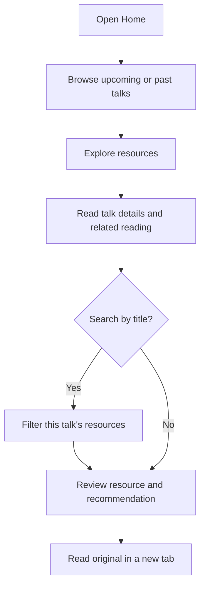
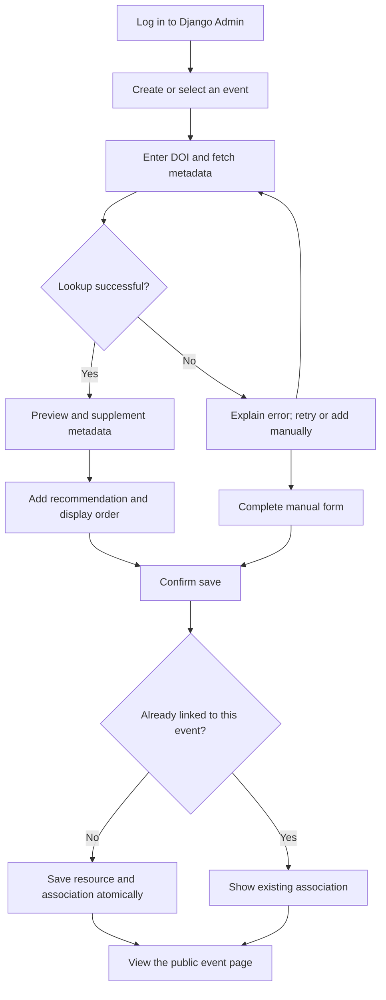

# PsychTalk Hub — Product Design Document

Version: MVP v0.1 | Date: 3 October 2026 | Status: Design specification; implementation not yet verified

[中文版](design-document.zh-CN.md) · [Technology stack](tech-stack.md)

This document is the product requirements and interaction-design reference. Its Chinese counterpart specifies the same behaviour. Technical choices and deployment guidance are maintained in the technology-stack document.

## 1. Product overview and scope

PsychTalk Hub is a learning-resource platform for psychology talks. Organisers curate relevant papers and articles; visitors explore reading before an upcoming talk and continue learning after a past talk.

The product hypothesis is that a shared activity page makes reading easier to find and reduces repeated resource-sharing work. This remains unvalidated. The product is an independent portfolio prototype inspired by public information about Conn8cting, with no official affiliation.

| Audience | Main task | Intended outcome |
| --- | --- | --- |
| Visitor | Open a talk and explore its reading | Find relevant resources without creating an account |
| Organiser | Add and maintain reading for a talk | Publish a useful resource page and share its URL |
| Portfolio reviewer | Browse the public demo and watch the admin video | Understand the product and its management workflow |

The three-day MVP includes two public pages, Django Admin, DOI import, manual resources, title search, and basic error handling. It excludes registration, booking links, payments, chat, AI recommendations, multi-tenancy, a global research search, and native mobile apps.

All product UI and demonstration content use English. This document and its Chinese counterpart specify the same behaviour.

## 2. Information architecture

| Surface | Proposed route | Contents and access |
| --- | --- | --- |
| Home | `/` | Upcoming and past talks; public |
| Talk details | `/events/{id}` | Talk information and related reading; public |
| Administration | `/admin/` | Login, event/resource maintenance and DOI import; authorised administrators only |

There is no separate resource detail page. Reading links lead to the original external website. The public navigation contains the product name linking to Home; it does not advertise administrator credentials or a login action.

The public demo supports visitor browsing. A short video shows event creation, DOI preview, confirmation and duplicate handling. Administrator credentials remain private.

## 3. Visual and accessibility direction

The interface should feel like a warm learning community: calm, readable and welcoming, with resource information taking priority over decoration.

| Token | Design value |
| --- | --- |
| Page background | Warm white, `#FAF8F4` |
| Card background | White, `#FFFFFF` |
| Primary colour | Deep green, `#245448` |
| Main text | `#23332D` |
| Secondary text | `#56645D` |
| Border | `#DDDCD4` |
| Error text | `#A32626`, accompanied by an explanatory message |
| Font | System sans-serif stack; no external font dependency |
| Type sizes | Body 16 px; section title 24 px; page title 36 px desktop / 28 px mobile |
| Spacing | 8 px base; use 8, 16, 24 and 32 px increments |
| Content width | Maximum 1080 px; horizontal padding 24 px desktop / 16 px mobile |
| Cards and controls | Card radius 12 px; input/button radius 8 px; controls at least 44 px high |

Below 768 px, talk cards use one column; at 768 px and above, they use two columns. Resource cards always use one column. Long titles and links wrap without horizontal scrolling.

Use visible keyboard focus, explicit input labels, semantic headings and text explanations for errors. Do not rely on colour alone to convey status. Check text contrast before implementation is accepted. No cover images, icon pack or complex animation is required. Django Admin retains its standard styling; custom import screens use its existing forms and messages.

## 4. Home page

### Layout and content

The header shows **PsychTalk Hub**. The introduction reads **Keep learning beyond the talk.**, followed by **Explore reading for upcoming and past psychology talks.**

Show `Upcoming talks` first and `Past talks` second. Each card contains the talk title, topic, London-local start time, speaker, related-resource count, and an `Explore resources` action.

- An event is upcoming when its start instant is later than the current instant; otherwise it is past. No end-time field is introduced.
- Upcoming talks sort by start time ascending; past talks sort by start time descending. Equal start times use event ID ascending.
- Use `Europe/London` for display, including the applicable GMT/BST label. The admin form clearly states its time zone.
- Both groups remain visible when empty, with a short message. An event with zero resources still has a working detail page.
- Refreshing a detail URL or using browser Back must work normally.

### Low-fidelity wireframe 1

```text
+------------------------------------------------------+
| PsychTalk Hub                                        |
+------------------------------------------------------+
| Keep learning beyond the talk.                       |
| Explore reading for upcoming and past psychology     |
| talks.                                               |
|                                                      |
| Upcoming talks                                       |
| +-----------------------+ +------------------------+ |
| | Example event         | | Example event          | |
| | Title / topic         | | Title / topic          | |
| | Date, time, GMT/BST   | | Date, time, GMT/BST    | |
| | Speaker / 3 resources | | Speaker / 3 resources  | |
| | [Explore resources]   | | [Explore resources]    | |
| +-----------------------+ +------------------------+ |
|                                                      |
| Past talks                                           |
| +--------------------------------------------------+ |
| | Example event / title / date / speaker            | |
| | 3 resources                     [Explore resources]| |
| +--------------------------------------------------+ |
| Independent portfolio prototype · Example events     |
+------------------------------------------------------+
```

The wireframe illustrates hierarchy; every talk card uses the same structure in the final grid.

## 5. Talk details and reading

Show `Back to talks`, an `Upcoming` or `Past` label, title, topic, time, speaker and description. Place the `Related reading` section immediately below the talk information.

The search input has the visible label `Search resources` and placeholder `Search by title`. Filtering is case-insensitive, uses the trimmed query as a title substring, and affects only resources linked to this event. Update results as the user types; clearing the query restores the full list and administrator-defined order. No server-wide or Crossref search is exposed to visitors.

Each resource card displays:

1. Resource type: `Research paper` or `Article / web resource`.
2. Title, authors and publication year.
3. `Why this reading?` and the organiser's recommendation.
4. `Read original`, opening the original URL in a new tab with that behaviour indicated in its accessible label.

Missing authors display `Author not provided`; a missing year displays `Year not provided`. Display recommendations as written by the organiser; do not generate scientific conclusions. If no recommendation is supplied, omit that block. The platform links to sources and does not host paper full texts or guarantee publisher access.

### Low-fidelity wireframe 2

```text
+------------------------------------------------------+
| PsychTalk Hub                                        |
| < Back to talks                                      |
|                                                      |
| Example event                           [Upcoming]   |
| Talk title                                           |
| Topic · Date, time, GMT/BST · Speaker                 |
| Short description                                    |
|                                                      |
| Related reading                                      |
| Search resources                                     |
| [Search by title                              ]      |
| 3 resources                                          |
| +--------------------------------------------------+ |
| | Research paper                                   | |
| | Resource title                                   | |
| | Author names · Publication year                  | |
| | Why this reading?                                | |
| | Organiser's short recommendation                 | |
| | [Read original]                                  | |
| +--------------------------------------------------+ |
| More resource cards                                  |
+------------------------------------------------------+
```

## 6. Administration and publishing

### Event maintenance

Administrators create and edit title, description, topic, start time and speaker using Django Admin. Title and start time are required. Saved events are immediately public, including events with no reading yet; no draft or approval stage exists. Show a link to the public page after saving.

### DOI import

Provide a small two-step import form within Django Admin, with the target event always visible:

1. Enter a DOI and select `Fetch metadata`. Accept a bare DOI or a `https://doi.org/` link and normalise it before lookup.
2. Preview the title, authors, year and original URL obtained through the server-side Crossref integration. Supplement missing fields and add a recommendation and numeric display order.
3. Select `Save to event`. The resource and its event association are persisted together; successful saving makes the association public immediately.
4. Display `Resource added to this talk.` and a link to the public page.

Fetching and previewing do not persist a resource. Disable the relevant submit control while a request is pending and show `Fetching…` or `Saving…`. Do not overwrite user-entered values after an unsuccessful save. Cancelling the preview returns to the event without writing data.

### Manual resources and existing resources

`Add manually` requires a title and an HTTP(S) original URL. Authors and year are optional. Add the recommendation and numeric display order when linking it to an event. Administrators can also select an existing resource instead of importing it again.

Resource metadata is shared between events. Before saving an edit to an existing resource, display: **Changes to this resource will appear in every talk that uses it.** Recommendations and display orders belong to each event association and can be edited independently.

Remove an association through `Remove from this talk`, with the confirmation **Remove this reading from this talk? Other talks will keep it.** Resource deletion is not part of this workflow. All writes, including import requests, require server-side administrator authorisation.

## 7. Content and data rules

| Entity | Responsibility |
| --- | --- |
| Event | Talk title, description, topic, start time and speaker |
| Resource | Shared title, authors, year, original URL, optional DOI, resource type and metadata source |
| EventResource | Event/resource relationship, optional recommendation and numeric display order |

- Store a normalised DOI once per resource; match an existing DOI before creating another resource.
- Enforce a unique event/resource association in the database. Repeated clicks or concurrent saves must not create duplicates.
- When a DOI already exists in another talk, reuse the resource without silently overwriting its metadata. When it is already linked to the target talk, show the existing association instead of creating another.
- Sort resources by display order ascending, then association ID ascending. Default display order is `0`; equal values preserve association creation order.
- Missing authors/year are allowed; a non-empty title and valid HTTP(S) original URL are required before saving.
- Imported metadata is bibliographic information, not an endorsement of research quality. Save only the fields needed for the cards; do not add automated summaries or import abstracts in the MVP.
- Every seeded demonstration event carries an `Example event` label. The public footer states: `Independent portfolio prototype. Not affiliated with Conn8cting.` Use fictional event details and identify any illustrative reading as such.

## 8. User journeys

### Visitor journey



### Administrator DOI journey



The journeys do not require visitor accounts. Saved changes become visible on the next successful page load; real-time updates are outside the MVP.

## 9. Loading, empty and failure states

| Context | English UI copy | Behaviour |
| --- | --- | --- |
| Loading a public page | `Loading talks…` / `Loading resources…` | Show a stable loading region; do not show an empty-state message yet |
| No upcoming talks | `No upcoming talks yet. Explore past talks below.` | Keep the past-talks section available |
| No past talks | `No past talks yet.` | Keep the upcoming-talks section available |
| No talks at all | `Talks will appear here when they are added.` | Display the message below the introduction |
| No linked resources | `Reading resources will be added here soon.` | Retain the event information; omit search until resources exist |
| No search results | `No resources match your search.` | Offer `Clear search` without changing the event |
| Event not found | `We couldn't find this talk.` | Offer `Back to talks` |
| Public request failed | `We couldn't load this page. Please try again.` | Offer `Retry`; do not report this as an empty list |
| Invalid DOI input | `Enter a valid DOI or DOI link.` | Keep the input; do not call Crossref or save a record |
| DOI not found | `No publication was found for this DOI.` | Allow input correction or `Add manually` |
| Lookup timed out / provider unavailable | `We couldn't fetch publication details. Please try again or add the resource manually.` | Keep the DOI; allow retry or manual entry; no automatic retry loop |
| Incomplete metadata | `Some details are missing. Review before saving.` | Missing authors/year are allowed; require title and original URL |
| Duplicate association | `This resource is already linked to this talk.` | Offer the existing record; create no duplicate |
| Save failed | `We couldn't save this resource. Please try again.` | Keep form values and ensure no partial association is committed |
| Unauthorised admin action | `You don't have permission to make this change.` | Reject writes; require a valid administrator session |

## 10. Delivery and acceptance

Use React + Vite, Django + Django REST Framework, PostgreSQL, Crossref REST API and GitHub Actions, with version recommendations and deployment details defined in the [technology stack](tech-stack.md). Use Django Admin rather than implementing a React management dashboard. Public data reading and administrator-only writing remain separate capabilities; this document does not fix a detailed API payload contract.

| Day | Intended milestone |
| --- | --- |
| 1 | Models, Django Admin, read APIs, public React pages, example data and an early deployment attempt |
| 2 | DOI preview/save, search, permissions, duplicate protection, failure handling and key automated tests |
| 3 | Deployment fixes, mobile checks, README, bilingual design documentation and demonstration video |

Accept the MVP when these scenarios pass:

- At least two example events have at least three resources each; the demo includes upcoming and past events.
- Upcoming/past grouping and order are correct, including the exact start-time boundary and London time display.
- Visitors can browse without logging in, open a direct event URL, refresh it and use browser Back.
- Search stays within the current event; case differences, surrounding spaces, clearing and no matches behave as specified.
- Valid DOI import supports preview, confirmation, cancellation and immediate publication; manual resources can also be added.
- Duplicate DOI use reuses metadata, while repeated/concurrent association saves create only one link.
- Invalid DOI, lookup failure, missing optional fields and unsuccessful saves produce the defined states without partial data.
- Resource ordering and per-event recommendations work independently; removing a link leaves other events intact.
- Anonymous or non-administrator requests cannot perform writes; the demo does not expose administrator credentials.
- The pages work at 375 px and 1280 px widths, with wrapping, labelled inputs and visible keyboard focus.
- Backend tests run in CI; README covers setup, sample data, architecture and known limitations. The video demonstrates management operations.

### Further iteration

After the MVP, invite a small number of visitors and organisers to test whether the reading is useful and importing it saves effort. Use their feedback to prioritise cross-event topic filters, personal bookmarks or post-event resource emails. These are possible later features, outside the current MVP.

Document checks: both languages have matching sections, rules, wireframes and flows; Markdown fences and tables are valid; relative links resolve; product behaviour and technology choices remain consistent across the documents. These are planned acceptance criteria, not claims of completed implementation or measured business impact.
