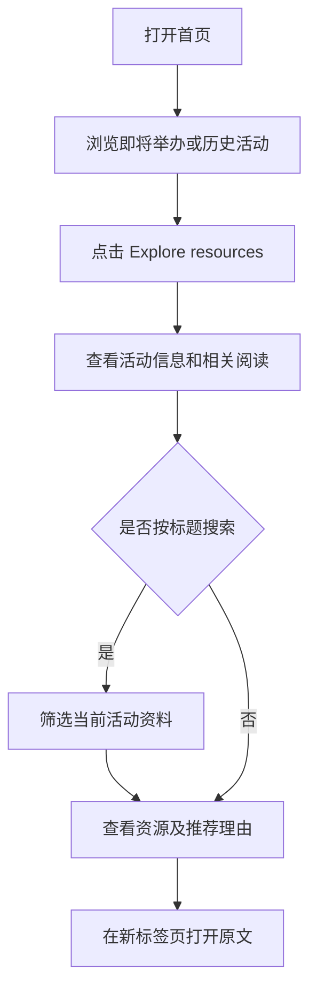
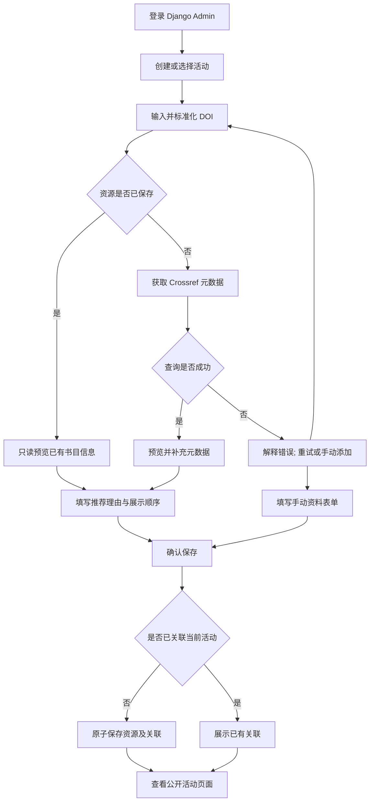

# PsychTalk Hub — 产品设计文档

版本：MVP v0.2｜日期：2026 年 10 月 3 日｜状态：设计规范，尚未验证实现

[English version](design-document.md) · [技术栈](tech-stack.md)

本文作为产品需求与交互设计的依据，英文版规定相同的产品行为。技术选型和部署方式统一记录在技术栈文档中。

## 1. 产品概述与范围

PsychTalk Hub 是一个面向心理学讲座的学习资源平台。组织者整理相关论文和文章；访客可以在即将举办的讲座前预习，也可以在过去的讲座后继续阅读。

产品假设是：共用的活动页面让资料更容易被找到，并减少组织者重复分享资料的工作。该假设尚未验证。产品是受 Conn8cting 公开信息启发的独立作品集原型，与该公司无官方隶属关系。

| 用户 | 主要任务 | 预期结果 |
| --- | --- | --- |
| 访客 | 打开活动并浏览相关阅读 | 无需注册即可找到相关资料 |
| 组织者 | 添加和维护活动资料 | 发布有用的资料页面并分享链接 |
| 作品集评审者 | 浏览公开 Demo，观看后台视频 | 理解产品及其管理流程 |

三天 MVP 包含两个公开页面、Django Admin、DOI 导入、手动资料、标题搜索和基础异常处理。不包含会员注册、报名链接、支付、聊天、AI 推荐、多租户、全站研究搜索和原生移动应用。

18–24 小时的预算以可审阅版本为目标，优先完整核心流程、关键测试、GitHub 和可复现说明。未完成的线上验收或视频必须明确列为后续待办。完整 MVP 仍需通过下文全部验收，不能省略权限、事务或去重验证。

产品界面和演示内容均使用英文。本文与英文版规定相同的产品行为。

## 2. 信息架构

| 页面 | 建议路径 | 内容与访问权限 |
| --- | --- | --- |
| 首页 | `/` | 即将举办与历史活动；公开访问 |
| 活动详情 | `/events/{id}` | 活动信息与相关阅读；公开访问 |
| 管理后台 | `/admin/` | 登录、活动与资源维护、DOI 导入；仅授权管理员可操作 |

不设置独立的资源详情页，阅读链接直接跳转到外部原文网站。公开导航显示链接到首页的产品名称，不展示管理员账号或登录入口。

公开 Demo 提供访客浏览体验。短视频展示创建活动、预览 DOI、确认保存和重复资料处理；管理员账号保持私有。

## 3. 视觉与可访问性方向

界面呈现温暖的学习社区气质：安静、易读、友好，资料信息的优先级高于装饰。

| 设计项 | 规定值 |
| --- | --- |
| 页面背景 | 暖白，`#FAF8F4` |
| 卡片背景 | 白色，`#FFFFFF` |
| 主色 | 深绿，`#245448` |
| 正文 | `#23332D` |
| 次要文字 | `#56645D` |
| 边框 | `#DDDCD4` |
| 错误文字 | `#A32626`，同时提供文字解释 |
| 字体 | 系统无衬线字体，不依赖外部字体 |
| 字号 | 正文 16 px；区域标题 24 px；页面标题桌面 36 px、移动端 28 px |
| 间距 | 以 8 px 为基础，使用 8、16、24、32 px |
| 内容宽度 | 最大 1080 px；桌面左右留白 24 px、移动端 16 px |
| 卡片与控件 | 卡片圆角 12 px；输入框与按钮圆角 8 px；控件高度至少 44 px |

宽度小于 768 px 时活动卡片为单列，达到 768 px 时为双列。资源卡片始终单列。长标题和链接可以换行，不产生横向滚动。

提供清晰的键盘焦点、输入框标签、语义化标题和错误解释，不仅靠颜色传达状态。实现验收前检查文字对比度。不要求封面图、图标包或复杂动画。Django Admin 保留默认样式，自定义导入页面沿用后台表单和消息样式。

## 4. 首页

### 布局与内容

页头展示 **PsychTalk Hub**。介绍标题为 **Keep learning beyond the talk.**，说明为 **Explore reading for upcoming and past psychology talks.**

先展示 `Upcoming talks`，再展示 `Past talks`。每张卡片包含活动标题、主题、伦敦当地开始时间、讲者、关联资源数量和 `Explore resources` 操作。

- 开始时间晚于当前时刻的活动归入 Upcoming；其余归入 Past，不增加结束时间字段。
- Upcoming 按开始时间升序，Past 按开始时间降序；时间相同时按活动 ID 升序。
- 使用 `Europe/London` 展示时间，并显示适用的 GMT/BST 标识。后台表单明确标注时区。
- 分组为空时仍保留该区域并显示提示。资源数量为零的活动仍可进入详情页。
- 直接刷新详情链接或使用浏览器返回，都应正常工作。

### 低保真线框图 1

```text
+------------------------------------------------------+
| PsychTalk Hub                                        |
+------------------------------------------------------+
| Keep learning beyond the talk.                       |
| Explore reading for upcoming and past psychology     |
| talks.                                               |
|                                                      |
| Upcoming talks                                       |
| +-----------------------+ +------------------------+ |
| | Example event         | | Example event          | |
| | Title / topic         | | Title / topic          | |
| | Date, time, GMT/BST   | | Date, time, GMT/BST    | |
| | Speaker / 3 resources | | Speaker / 3 resources  | |
| | [Explore resources]   | | [Explore resources]    | |
| +-----------------------+ +------------------------+ |
|                                                      |
| Past talks                                           |
| +--------------------------------------------------+ |
| | Example event / title / date / speaker            | |
| | 3 resources                     [Explore resources]| |
| +--------------------------------------------------+ |
| Independent portfolio prototype · Example events     |
+------------------------------------------------------+
```

线框图用于表达信息层级；最终网格中的所有活动卡片采用相同结构。

## 5. 活动详情与相关阅读

展示 `Back to talks`、`Upcoming` 或 `Past` 状态、标题、主题、时间、讲者及简介。活动信息下方直接展示 `Related reading`。

搜索框有明确标签 `Search resources`，占位文字为 `Search by title`。搜索忽略大小写，并去掉查询两端空白，以标题包含查询文本的方式匹配，只作用于当前活动关联的资料。输入时更新结果；清空后恢复完整列表和管理员设置的顺序。不向访客提供全站搜索或 Crossref 搜索。

每张资源卡片展示：

1. 资源类型：`Research paper` 或 `Article / web resource`。
2. 标题、作者和发表年份。
3. `Why this reading?` 及组织者填写的推荐理由。
4. `Read original`，在新标签页打开原文，可访问名称中说明该行为。

作者缺失时显示 `Author not provided`，年份缺失时显示 `Year not provided`。推荐理由按组织者填写的内容展示，不自动生成科学结论；未填写推荐理由时省略该区域。平台提供原文链接，不托管论文全文，也不保证出版方提供免费访问。

### 低保真线框图 2

```text
+------------------------------------------------------+
| PsychTalk Hub                                        |
| < Back to talks                                      |
|                                                      |
| Example event                           [Upcoming]   |
| Talk title                                           |
| Topic · Date, time, GMT/BST · Speaker                 |
| Short description                                    |
|                                                      |
| Related reading                                      |
| Search resources                                     |
| [Search by title                              ]      |
| 3 resources                                          |
| +--------------------------------------------------+ |
| | Research paper                                   | |
| | Resource title                                   | |
| | Author names · Publication year                  | |
| | Why this reading?                                | |
| | Organiser's short recommendation                 | |
| | [Read original]                                  | |
| +--------------------------------------------------+ |
| More resource cards                                  |
+------------------------------------------------------+
```

## 6. 管理后台与发布

### 活动维护

管理员通过 Django Admin 创建和编辑标题、简介、主题、开始时间及讲者。标题和开始时间必填。保存后立即公开，包括尚无资料的活动；不设置草稿或审批阶段。保存后提供公开页面链接。

简介、主题和讲者为可选字符串，为空时省略对应展示。删除活动需确认：**Delete this talk and its reading links? Shared resources will be kept.** 删除活动及其关联，保留所有 Resource；单条和批量活动删除均遵循此规则。禁用共享资源删除，包括批量操作和直接访问删除地址。

### DOI 导入

在 Django Admin 中提供两步导入表单，并始终显示目标活动：

1. 输入 DOI，点击 `Fetch metadata`。接受纯 DOI 或 `https://doi.org/` 链接，查询前统一格式。先检查已保存的资源，已有 DOI 无需再次请求 Crossref。
2. 新 DOI 预览由服务端 Crossref 获取的标题、作者、年份和原文链接，补充缺失信息，填写推荐理由和数字展示顺序；已有 DOI 展示只读的数据库书目信息，只编辑当前活动的推荐理由与顺序。共享信息修改应进入 Resource 编辑页。
3. 点击 `Save to event`，在同一次保存中写入资源及活动关联。成功后，该关联立即公开。
4. 展示 `Resource added to this talk.` 和公开页面链接。

获取和预览阶段不创建或修改 Resource、EventResource，允许保存受保护的会话状态。请求进行中禁用对应提交按钮，显示 `Fetching…` 或 `Saving…`。保存失败后保留已填写内容。取消预览使其失效并返回活动管理，不改变资源或关联。

每次预览在 Django 数据库会话中拥有独立随机标识，绑定管理员及目标活动。自成功获取元数据或加载已有资源起 15 分钟过期，编辑和重试不延长期限。多个标签页分别保留各自预览。确认时重新检查会话、模型权限、目标活动、有效期和字段。有效期内重复确认返回已有结果，不修改其推荐理由或顺序。过期、取消或无效预览不能保存，展示下文规定的状态并提供重新获取入口；确认前活动已被删除时拒绝保存并返回活动管理。

### 手动资料与已有资源

`Add manually` 要求填写标题和 HTTP(S) 原文链接，作者与年份可选；关联活动时填写推荐理由和数字展示顺序。管理员也可以选择已有资源，不必再次导入。

手动资料不按标题或 URL 自动合并，管理员可以主动选择已有资源。手动来源为 `manual`；导入资料即使修改书目信息也保留 `crossref` 来源。

资源的书目信息由多个活动共享。保存已有资源的修改前，明确提示：**Changes to this resource will appear in every talk that uses it.** 推荐理由和展示顺序属于各自的活动关联，可独立修改。

通过 `Remove from this talk` 移除关联，确认文案为 **Remove this reading from this talk? Other talks will keep it.** 所有写入操作，包括导入请求，均需要服务端验证管理员身份及 Django 模型权限。MVP 不设置活动所有权规则或多租户权限。

## 7. 内容与数据规则

| 实体 | 职责 |
| --- | --- |
| Event | 活动标题、简介、主题、开始时间、讲者、示例标记及可选的稳定导入标识 |
| Resource | 共用的标题、作者、年份、原文链接、可选 DOI、资源类型、元数据来源及可选的稳定导入标识 |
| EventResource | 活动与资源的关联、可选推荐理由及数字展示顺序 |

- 每个标准化 DOI 只对应一条资源；创建前先匹配已有 DOI。
- 数据库保证活动与资源关联唯一，重复点击或并发保存不能产生重复关联。
- DOI 已存在于其他活动时复用该资源，不静默覆盖其元数据；已关联当前活动时展示已有记录，不新建关联。
- 资源按展示顺序升序，其次按关联 ID 升序。展示顺序默认为 `0`，相同值按关联创建先后展示。
- 允许作者和年份缺失；保存前必须有非空标题与有效的 HTTP(S) 原文链接。
- 导入的元数据是书目信息，不代表对研究质量的认可。仅保存卡片所需字段；MVP 不增加自动总结或摘要导入。
- 每个预置演示活动展示 `Example event` 标识。公开页脚显示 `Independent portfolio prototype. Not affiliated with Conn8cting.` 开发者为两场虚构讲座精选并核对真实论文和文章，每场至少三条资源。示例活动详情展示 `Reading selections are illustrative; these talks are fictional.`，不得虚构论文标题、作者或 DOI。
- 活动和无 DOI 资源使用稳定导入标识，导入资源按标准化 DOI 匹配。重复导入只补缺失记录及关联，不覆盖人工修改。首次创建时，未来活动设为导入时刻后 30 天，历史活动设为此前 7 天；后续导入不自动调整日期，验收时重新检查是否同时包含未来和过去活动。

### DOI 与书目信息转换

- 去掉两端空白并将 DOI 转为小写。纯 DOI 以 `10.` 开头，其后为 4–9 位注册者数字、`/` 和不含空白的非空后缀。保留后缀标点，不凭经验删除末尾标点。
- DOI 链接仅接受 HTTPS、精确主机名 `doi.org`，不允许凭据、显式端口、查询参数或片段。路径解码一次后按纯 DOI 校验；其他域名在网络请求前拒绝，将标准化 DOI 编码为固定 Crossref 接口中的单个标识。
- 取首个非空标题。作者按来源顺序组合 given 与 family；缺少个人姓名时使用组织名称，以 `; ` 分隔。作者缺失保留为空字符串。
- 年份依次取 `published-print`、`published-online`、`issued` 中首个有效整数，范围为 1–9999；没有则为空值。原文采用 Crossref 的 HTTP(S) URL，缺失或无效时要求管理员补充后才可保存。
- `journal-article` 和 `proceedings-article` 映射为 `research_paper` / `Research paper`；其他 Crossref 类型映射为 `article` / `Article / web resource`。手动录入可选择两种类型。来源仅为 `crossref` 或 `manual`，不保存摘要或生成总结。

### 公开 API 契约

字段和类型的唯一详细规范见[技术栈 — 公开 API 契约](tech-stack.md#public-api-contract)。列表返回未分页的活动数组，详情包含相同字段及已排序资源。ID 为整数，时间为 UTC ISO 8601，缺失作者为空字符串，缺失年份与 DOI 为 null。错误返回包含 JSON `detail` 字符串，不存在的活动为 404，不允许的方法为 405；不向访客返回会话或预览标识。

## 8. 用户路径

### 访客路径



### 管理员 DOI 路径



访客路径不要求账号。保存后的变化在下一次成功加载页面时展示；MVP 不提供实时更新。

## 9. 加载、空状态与异常

| 场景 | 英文界面文案 | 处理方式 |
| --- | --- | --- |
| 公开页面加载中 | `Loading talks…` / `Loading resources…` | 保留稳定的加载区域，此时不显示空状态 |
| 没有即将举办的活动 | `No upcoming talks yet. Explore past talks below.` | 历史活动区域仍可访问 |
| 没有历史活动 | `No past talks yet.` | 即将举办区域仍可访问 |
| 完全没有活动 | `Talks will appear here when they are added.` | 在介绍下方展示提示 |
| 没有关联资料 | `Reading resources will be added here soon.` | 保留活动信息，有资料前不显示搜索框 |
| 搜索无结果 | `No resources match your search.` | 提供 `Clear search`，不改变活动 |
| 活动不存在 | `We couldn't find this talk.` | 提供 `Back to talks` |
| 公开页面请求失败 | `We couldn't load this page. Please try again.` | 提供 `Retry`，不误显示为空列表 |
| DOI 输入无效 | `Enter a valid DOI or DOI link.` | 保留输入，不调用 Crossref，不保存记录 |
| DOI 找不到记录 | `No publication was found for this DOI.` | 允许修改输入或 `Add manually` |
| 查询超时或服务不可用 | `We couldn't fetch publication details. Please try again or add the resource manually.` | 保留 DOI，允许重试或手动录入，不自动循环重试 |
| 元数据不完整 | `Some details are missing. Review before saving.` | 作者和年份可缺失，标题和原文链接必填 |
| 重复关联 | `This resource is already linked to this talk.` | 提供已有记录，不产生重复数据 |
| 预览过期、无效或已取消 | `This preview is no longer valid. Fetch metadata again.` | 拒绝保存，提供重新获取入口 |
| 导入期间活动被删除 | `This talk is no longer available.` | 拒绝保存，提供返回活动管理入口 |
| 保存失败 | `We couldn't save this resource. Please try again.` | 保留表单值，保证不会留下部分完成的关联 |
| 后台操作未授权 | `You don't have permission to make this change.` | 拒绝写入，要求有效的管理员会话 |

## 10. 交付与验收

采用 React + Vite、Django + Django REST Framework、PostgreSQL、Crossref REST API 和 GitHub Actions，API 契约、具体版本建议与部署细节以[技术栈](tech-stack.md)为准。使用 Django Admin，不新增 React 管理面板。公开数据读取与管理员写入属于不同权限能力。

开发使用独立 Python 3.13 和 PostgreSQL 17 环境，保留已有安装。线上使用一个免费 Render Web Service 与同区域免费数据库，不升级付费服务；记录冷启动、数据库到期日期及备份限制。手动部署已验证提交，启动时先执行迁移再运行 Gunicorn。示例数据及私有管理员通过本地受控生产连接单独初始化；账号连接缺失或免费资源不可用时记为外部阻塞，不据此购买服务。

| 时间 | 预期里程碑 |
| --- | --- |
| 第 1 天 | 数据模型、Django Admin、只读 API、React 公开页面、示例数据，提前锁定依赖、建立 CI 与健康检查，最小生产静态集成及部署尝试 |
| 第 2 天 | DOI 预览与保存、搜索、权限、去重、异常处理及关键自动化测试 |
| 第 3 天 | 可复现性与部署检查、移动端检查、README、双语文档与视频；交付可审阅版本并明确列出剩余事项 |

完整 MVP 必须通过以下全部场景；三天可审阅版本必须明确标注未通过的事项：

- 至少两场演示活动，每场至少三条资源，同时包含即将举办和历史活动。
- 活动分组和排序正确，包括开始时间恰好等于当前时刻的边界，以及伦敦时间展示。
- 访客无需登录即可浏览，直接打开活动链接、刷新和浏览器返回均正常。
- 搜索仅限当前活动；大小写差异、两端空格、清空和无结果行为符合规定。
- 有效 DOI 支持预览、确认、取消和立即公开，手动资料也可添加。
- 预览在 15 分钟后过期，多标签页独立使用；其他会话或被篡改的目标不能保存，取消和过期拒绝写入，有效期内重复确认保持幂等。
- 重复 DOI 复用元数据，重复或并发保存只产生一条关联。
- 已有 DOI 导入预览中的书目信息只读，手动资料不自动合并；转换符合 DOI、作者、年份、类型及缺失 URL 的规则。
- 无效 DOI、查询失败、可选字段缺失和保存失败均有明确状态，不产生部分数据。
- 资源排序和推荐理由可按活动独立维护，移除关联不影响其他活动。
- 确认删除活动仅删除该活动及关联；共享资源的单条、批量及直接地址删除均被拒绝。
- API 字段类型、空值、排序、JSON 错误、404 与 405 符合契约；重复导入示例保留日期、稳定标识及人工修改。
- 匿名用户或非管理员请求不能写入，Demo 不公开管理员账号。
- 页面在 375 px 和 1280 px 宽度下正常显示，文字可换行，输入框有标签，键盘焦点可见。
- CI 运行后端测试；README 说明启动、示例数据、架构及限制，视频展示管理流程。
- 免费部署先迁移再启动，迁移失败则启动失败，重新部署保留数据；不自动开通付费服务、导入生产示例或创建管理员。

### 后续迭代

MVP 完成后，邀请少量访客和组织者试用，验证相关阅读是否有用、导入是否省时。根据反馈决定跨活动主题筛选、个人收藏或活动后资源邮件的优先级。这些属于可能的后续功能，不在当前 MVP 范围内。

文档检查：两种语言的章节、规则、线框图与流程对应；Markdown 代码块及表格结构有效；相对链接可解析；各文档的产品行为与技术选型保持一致。以上均为计划中的验收要求，不代表功能已实现或业务效果已测量。
