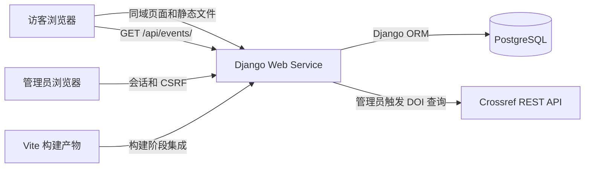

# PsychTalk Hub — 技术栈推荐

Current stage / 当前阶段 (7 October 2026): verified release **06f98e2** is Live; local checks, exact-commit CI, current online core checks and authorized backup/isolated restore passed. Management video and complete production management acceptance remain pending, so this is not full MVP acceptance. Product and API rules below are unchanged. Actual evidence: [progress](progress.md), [architecture](architecture.md), [delivery](../DELIVERY.md).

日期：2026-10-03｜版本：v0.2｜适用范围：三天可审阅版本，约 18–24 小时｜状态：技术选型与接口规范，尚未安装或验证项目依赖

产品需求与交互设计依据：[英文产品设计](design-document.md)、[中文产品设计](design-document.zh-CN.md)。本文负责具体技术选型、版本建议与部署方式。

目录说明：本文提到的 backend、frontend、memory-bank 和工作流目录均相对仓库根目录；Markdown 文档链接相对当前文件所在目录。

## 1. 推荐结论

采用 **React + Vite + JavaScript + Django REST Framework + Django Admin + PostgreSQL**，生产环境使用 **Gunicorn + WhiteNoise**，部署到 **Render 的一个免费 Web Service 和一个免费托管 PostgreSQL 数据库**，通过 **GitHub Actions** 执行检查。不自动开通或升级付费服务。

前后端代码在同一仓库，生产环境使用同一域名。React 负责首页和活动详情页；Django 负责 API、管理员操作、数据校验和 Crossref 调用。Node.js 只用于开发和构建前端，生产请求由 Django 服务处理。

这个组合遵循设计文档的产品范围，并利用你已有的 Python/Django 基础。健壮性来自权限、约束、事务、超时和可重复部署；第一版保持较少的依赖和运行服务。

## 2. 核心技术与版本基线

以下是推荐的兼容版本系列。实施时选择系列内最新的稳定补丁版本，运行测试后锁定准确版本；不使用预发布版。

| 层级 | 推荐选择 | 用途与理由 |
| --- | --- | --- |
| Python | 3.13.x | 后端运行时，与选定的 Django/DRF 系列兼容 |
| Web 框架 | Django 5.2.x LTS | 内置 ORM、迁移、表单、会话和 Admin，减少需要自己搭建的基础功能 |
| REST API | Django REST Framework 3.16.x | 序列化、只读接口、统一异常响应和 API 测试工具 |
| 数据库 | PostgreSQL 17.x | 保存活动、资源和关联，支持唯一约束与事务 |
| 数据库驱动 | Psycopg 3，`psycopg[binary]` | 简化本地与托管环境的驱动安装 |
| 前端 | React 19.3.x + JavaScript | 用两个页面展示 React 能力，控制学习和调试范围 |
| 前端构建 | Vite 8.3.x + 官方 React 插件 | 开发服务器、热更新和静态构建 |
| Node.js | 24.x LTS，使用 npm | 与 Vite 配套，统一本地、CI 和部署构建环境 |
| 页面路由 | React Router 7.x，Declarative 模式 | 处理 `/` 和 `/events/:id`；不启用其服务端框架功能 |
| 样式 | 普通 CSS + CSS 自定义属性 | 直接实现设计文档的颜色、间距、断点和焦点样式 |
| 浏览器请求 | 原生 `fetch` + `AbortController` | 两个只读页面不需要额外 HTTP 客户端或请求状态库 |

Django 5.2 是 LTS，并支持 Python 3.13；DRF 3.16 的官方兼容说明也包含 Django 5.2 和 Python 3.13。[Django 说明](https://docs.djangoproject.com/en/5.2/releases/5.2/)、[DRF 说明](https://www.django-rest-framework.org/community/3.16-announcement/)。

前端版本依据当前官方发布信息选择：React 19.3、Vite 8.3 和 Node.js 24 LTS。构建前再次核对各自的补丁版本和插件兼容性。[React 版本](https://react.dev/versions)、[Vite 支持版本](https://vite.dev/releases)、[Node.js 发布状态](https://nodejs.org/en/about/previous-releases)。

PostgreSQL 17 当前仍受支持；Django 5.2 支持 PostgreSQL 14 及以上版本，并推荐 Psycopg 3。[PostgreSQL 支持周期](https://www.postgresql.org/support/versioning/)、[Django 数据库说明](https://docs.djangoproject.com/en/5.2/ref/databases/#postgresql-notes)。

### 为什么 MVP 使用 JavaScript

你当前需要同时学习 React 和交付项目，先使用 Vite 的 `react` 模板。用 JSDoc 描述 API 返回对象，把请求集中到一个模块，配合 ESLint 和服务端校验降低错误风险。

TypeScript 可以在 MVP 完成后逐步迁移；本次不让新增类型工具链成为交付前置条件。CV 如实写 React/JavaScript，不将尚未使用的 TypeScript 列为该项目技术。

## 3. 架构和部署方式

### 本地开发

- Django 在 `localhost:8000` 运行，Vite 在 `localhost:5173` 运行。
- React 通过相对路径请求 `/api/`；Vite 将该路径代理到 Django，避免为本地开发引入 CORS 配置。
- 管理员直接访问 Django 的 `/admin/`，后台登录和写入由 Django 自己处理。
- 独立安装 Python 3.13 和 PostgreSQL 17，项目使用独立虚拟环境及数据库实例，保留现有 Anaconda、Python 和旧 PostgreSQL 安装，不升级或覆盖它们。分别记录新实例端口与连接信息，避免端口冲突。
- 开发、测试和生产数据库分开；测试角色仅在独立开发实例具有创建测试数据库的权限。开发与 CI 不使用生产数据库地址，测试不能通过 SQLite 替代。
- Windows 本地使用 Django `runserver`；Gunicorn 用于 Linux 生产环境，不要求在 Windows 上运行。

### 生产部署

使用一个免费 Render Python Web Service，加同区域的免费 PostgreSQL 17 数据库；单实例，Gunicorn 初始使用一个 worker。若免费额度、所需数据库版本或账号连接不可用，记录外部阻塞，不静默换平台、换数据库主版本或购买服务。[Render Django 部署说明](https://render.com/docs/deploy-django)。

1. 构建阶段安装已锁定的 Python 依赖，用固定 Node.js 版本执行 `npm ci` 和前端构建。
2. Vite 资产使用 `/static/frontend/` 前缀，构建后放入 Django 静态目录；入口 HTML 放入模板目录。
3. Django 为 `/` 与 `/events/{id}` 返回 React 入口；React Router 处理页面切换。仅为这两类页面路由返回入口，不能将 `/api/` 或 `/admin/` 的错误转换成 HTML。
4. WhiteNoise 提供构建后的 JS/CSS 和 Admin 静态文件；Django 负责入口 HTML。WhiteNoise 本身不负责 SPA 路由回退。[WhiteNoise 配置说明](https://whitenoise.readthedocs.io/en/stable/django.html)。
5. 构建阶段运行 `collectstatic`；启动阶段先执行迁移，成功后才启动 Gunicorn，迁移失败必须使启动失败。免费 Web Service 没有付费服务的 pre-deploy command、后台 Shell 或一次性任务入口，不依赖这些能力。[Render 部署阶段](https://render.com/docs/deploys#pre-deploy-command)。
6. 初始示例数据和私有管理员通过本地受控操作连接生产数据库单独初始化，不加入构建、启动或重复部署流程。明确选择生产配置，使用加密数据库连接，不在终端输出或文档中记录凭据；随后恢复开发配置。账号初始化不使用公开 HTTP 入口。
7. 关闭自动部署；CI 通过后手动部署明确的提交，逐次发布。MVP 迁移采用与仍在运行的上一版本兼容的新增变更，不以迁移回滚作为代码回滚方式。初始阶段无账号时只完成本地部署配置及验证，远程状态标为未验证。

该项目无 WebSocket 或实时更新需求，采用 WSGI 即可；未来增加 worker 前重新核对内存及数据库连接预算。[Django 与 Gunicorn](https://docs.djangoproject.com/en/5.2/howto/deployment/wsgi/gunicorn/)。

用 Python 标准日志输出到托管平台日志，记录导入结果和异常类别，不记录密钥或完整外部响应。提供轻量的 `/healthz/` 检查应用和数据库连通性，不调用 Crossref；检查失败返回非成功状态，不暴露内部错误详情。它只用于部署健康检查，不新增监控平台。

**已确认的免费部署限制：** 免费 Render Web Service 空闲 15 分钟后休眠，会产生冷启动；免费 PostgreSQL 创建 30 天后到期，免费方案不提供备份。部署当天重新核对限制，在 README 记录创建日期、到期日期、冷启动及恢复方式。到期前通过本地受控连接手动导出数据，将备份放在仓库外；重建免费数据库需手动迁移和恢复，不保证原 Demo 持续可用，不自动升级付费方案。本次文档更新不创建服务或购买资源。[Render 免费方案限制](https://render.com/docs/free)。

## 4. 后端依赖与职责边界

| 工具 | 职责 |
| --- | --- |
| Django Admin、Forms、Auth | 活动维护、资料维护、DOI 预览/确认表单、管理员登录和权限 |
| Django ORM | 模型、查询、迁移、唯一约束及事务 |
| DRF | 访客只读 JSON API；不自动生成公开 CRUD 写入接口 |
| `requests` | 在独立 Crossref 服务模块中完成同步 HTTP 调用 |
| `django-environ` | 读取 `.env` 和部署环境变量，解析类型与数据库 URL |
| `whitenoise` | 提供生产静态文件 |
| `gunicorn` | Linux 生产 WSGI 服务器 |

环境配置统一使用 `django-environ`，避免同时引入多个 `.env` 或数据库 URL 解析工具。[配置文档](https://django-environ.readthedocs.io/en/latest/quickstart.html)。

建议一个 Django 业务应用管理 `Event`、`Resource`、`EventResource`，将 Crossref 查询和资源关联保存拆为小的服务函数。Django Forms 校验后台输入，DRF serializers 定义公开输出，避免在视图里堆积所有业务逻辑。

**最小接口：** `/api/events/` 提供活动列表和资源数量；`/api/events/{id}/` 提供活动信息和已排序的关联资料。公开 API 只允许 GET/HEAD/OPTIONS。活动资源数量很少，标题搜索在 React 中筛选已加载的当前活动资料，无需服务器搜索接口。

### Public API contract

本节是前后端字段契约的唯一详细来源；JSDoc、序列化器和测试应以此为准。以下为字段说明，不是应用代码或 JSON 示例。

| 接口 | 成功响应 |
| --- | --- |
| `/api/events/` | 200；未分页的活动对象数组，无额外包装；后端按 ID 升序返回，前端负责 Upcoming/Past 分组及排序 |
| `/api/events/{id}/` | 200；包含以下全部活动字段及 `resources` 的单个对象 |

| 活动字段 | 类型与规则 |
| --- | --- |
| `id` | 整数；稳定的活动主键 |
| `title` | 非空字符串 |
| `description`, `topic`, `speaker` | 字符串；可选，缺失使用空字符串，界面省略空内容 |
| `starts_at` | 字符串；UTC ISO 8601，使用 `Z` 后缀，前端始终按 Europe/London 显示 |
| `is_example` | 布尔值；示例活动为 true，普通创建活动默认为 false |
| `resource_count` | 非负整数；活动关联数量，详情也返回此字段 |
| `cover_image_url` | 字符串，可选，缺失为空；无凭据 HTTPS 图片地址或严格的 `/static/events/posters/[a-z0-9-]+.svg` 内置路径。服务端不下载图片 |
| `cover_image_alt` | 字符串，可选，缺失为空；有意义图片的替代文字，装饰图为空 alt。宣传图不替代正文的活动信息 |
| `resources` | 仅详情返回；关联资料对象数组；零资料为数组为空，按 `display_order`、`association_id` 升序 |

| 关联资料字段 | 类型与规则 |
| --- | --- |
| `association_id`, `resource_id` | 整数；分别表示 EventResource 和 Resource 主键 |
| `title` | 非空字符串；共享标题 |
| `authors` | 展示字符串；缺失为空字符串，多作者按来源顺序以 `; ` 分隔 |
| `year` | 1–9999 的整数或 null；缺失为 null |
| `original_url` | HTTP(S) URL 字符串；保存时必填 |
| `doi` | 标准化 DOI 字符串或 null；缺失为 null，不使用空字符串 |
| `resource_type` | `research_paper` 或 `article`；分别显示 Research paper、Article / web resource |
| `metadata_source` | `crossref` 或 `manual`；修改书目信息不改变来源 |
| `recommendation` | 当前活动关联的字符串；缺失为空字符串，界面省略对应区域 |
| `display_order` | 整数；默认为 0，同值按关联 ID 升序；允许负值排在前面 |

两个 API 的成功与错误响应均为 JSON；错误含非空字符串 `detail`。不存在的活动或未知 `/api/` 路径为 404，不允许的方法为 405，未处理的服务故障为 500 且不暴露异常详情。HEAD 返回相应状态及响应头，不带响应体；OPTIONS 只声明只读能力。API 不返回 seed 标识、会话、预览标识或管理员信息；未知 API 路径不得返回 React HTML。

## 5. 健壮性必须落在这些实现上

### 数据一致性

- `Resource.doi` 使用标准化值和数据库唯一约束；无 DOI 的手动资料使用 `NULL`，避免所有手动资料共用空字符串而发生冲突。
- `EventResource` 对 `(event, resource)` 设置唯一约束，防止重复点击和并发提交产生重复关联。
- 资源与关联的最终保存放在 `transaction.atomic()` 中；并发唯一冲突在回滚后转换为“已存在”的结果。
- Crossref 请求在事务外执行，预览阶段不创建或修改 Resource、EventResource；允许写受保护的数据库会话状态。最终保存再次检查已有资源，即使同一 DOI 在预览之后被并发创建，也复用当前数据库书目信息，不用预览字段覆盖它。
- 列表资源计数使用聚合，详情资料使用关联预加载，避免每张卡片各自触发数据库查询。
- Event 的 `is_example` 默认为 false；Event 与无 DOI 的预置 Resource 使用可空且唯一的 `seed_key`，普通记录使用 NULL。导入资源按 DOI 匹配，关联按活动/资源唯一组合匹配。重复导入只补缺，不覆盖人工修改或自动调整日期；首次未来活动为导入时刻后 30 天，历史活动为此前 7 天。
- 示例数据由开发者精选并核对真实论文、文章和原文链接，八场讲座使用虚构内容，每场三条阅读；资料与活动的匹配明确标为演示。手动资料不按标题或 URL 自动去重，可主动选择已有资源。宣传图按用户 7 October 2026 的扩展请求加入；Demo 用仓库内原创 SVG 静态发布，Admin 可配置 HTTPS 图片地址。当前不提供文件上传或临时磁盘图片持久化。

### 管理员权限

- 使用 Django 原生会话 Cookie 和 CSRF，不引入 JWT、OAuth 或自建登录系统。
- 自定义 Admin 导入视图通过 Admin 的权限包装，并检查 Django 模型权限；不增加对象所有权或多租户权限。所有提交，包括获取预览，使用受 CSRF 保护的 POST；GET 不保存或删除业务数据。
- 查看导入需 Event、Resource、EventResource 的查看权限，关联或导入需 Event 修改、EventResource 新增权限，创建新 Resource 还需 Resource 新增权限。关联修改与移除分别检查 EventResource 修改/删除权限；共享编辑检查 Resource 修改权限，活动删除检查 Event 与 EventResource 删除权限。每个自定义入口及确认操作都重新检查权限。
- 活动单条和批量删除都需确认，删除活动与关联但保留所有 Resource。Resource 单条、批量及直接删除 URL 均禁用，包含 superuser；从活动移除资料仅删除 EventResource。
- 生产关闭 `DEBUG`，设置明确的 `ALLOWED_HOSTS`，通过 HTTPS 提供页面，并启用安全会话 Cookie 和 CSRF Cookie。
- `.env`、密钥和数据库连接信息不提交到 Git；只提交不含真实值的 `.env.example`。

### Crossref 集成

- 只接受纯 DOI 与 HTTPS、精确主机名 `doi.org` 的链接；链接不允许凭据、显式端口、查询或片段，路径解码一次。去掉两端空白并转小写；验证 `10.`、4–9 位注册者数字、斜杠及不含空白的非空后缀，保留后缀合法标点。固定请求 `https://api.crossref.org/works/` 下编码后的单个 DOI，禁止跟随重定向到其他主机，不根据输入请求任意域名。
- 先按 DOI 检查数据库；已有资源不再请求 Crossref，预览书目信息只读，只编辑推荐理由与顺序。所有共享修改均进入 Resource 编辑页。每次用户获取动作最多触发一次外部请求；确认保存不访问 Crossref。
- 取首个非空标题；按作者来源顺序组合 given、family，个人姓名缺失时使用组织名称，以 `; ` 分隔，缺失作者为空字符串。年份依次取 `published-print`、`published-online`、`issued` 的首个有效整数年（1–9999），无则为 null。原文取返回的 HTTP(S) `URL`，无效或缺失时留空并要求管理员补充，不伪造标题或链接。
- `journal-article`、`proceedings-article` 映射为 `research_paper`，其他类型映射为 `article`；手动录入可选两种类型。DOI 导入来源为 `crossref`，手动资料为 `manual`，修改书目仍保留原来源。
- 初始设置连接超时 3 秒、读取超时 7 秒；处理记录不存在、429、5xx、无效 JSON、超时和缺失字段，映射到设计文档中的提示。
- 超时是连接/读取等待限制，不是整个下载的绝对总时限。服务端不自动循环重试，允许管理员手动重试或录入。[Requests 超时说明](https://requests.readthedocs.io/en/latest/user/quickstart/#timeouts)。
- 管理员导入频率低，第一版无需 Redis 缓存或异步任务队列；普通访客读取已保存的数据，不直接依赖 Crossref 在线可用性。

### DOI 预览状态

- 使用 Django 数据库会话，不使用进程内缓存或客户端隐藏字段作为可信状态。每次预览有独立随机标识，绑定管理员 ID、会话及 Event ID；会话内按标识分别保存，以支持多标签页。并发更新会话时锁定会话记录并合并各预览状态，避免整份会话覆盖另一标签页的数据；预览字段由该更新路径持久化，不再被默认整份会话回写覆盖。
- 有效期自查询成功或已有资源加载成功起固定 15 分钟；编辑、失败重试不延长。确认时根据服务器状态验证管理员、会话、目标、模型权限、到期时刻和提交字段，不信任提交的 DOI、活动标识或资源身份。
- 成功结果与资源、关联在同一短事务内持久化，会话结果写入失败时一并回滚；在原有效期内重复确认仅返回已有关联，不覆盖理由或排序。取消使该预览失效。过期、取消、篡改或缺失状态拒绝保存，提示重新获取。保存失败保留表单输入；活动已删除时拒绝写入并返回管理入口。成功结果对应的关联若已被移除，重复确认不得重新创建，应要求重新导入。
- 预览及取消允许修改会话数据，但不创建或修改 Resource、EventResource；数据库会话可以跨 worker 或部署读取，登录失效后不能继续确认。

### 前端与时间

- 使用 `useState`、`useEffect` 和小的请求模块管理加载、成功、失败状态；`fetch` 必须检查响应状态，组件离开时取消旧请求。
- 搜索使用去除两端空格后的标题包含匹配，忽略大小写，保持服务端给出的资料顺序。
- 启用 Django 时区支持，保存有时区的时间，以 UTC 交换时间；前端使用 `Intl.DateTimeFormat` 明确指定 `Europe/London` 展示日期时间。
- 用同一个当前时刻完成一次页面中的 Upcoming/Past 分组，边界使用 `starts_at > now`，与设计文档保持一致。

## 6. 测试、版本锁定和持续集成

**后端：** 使用 Django 自带测试框架、DRF 测试客户端和 `unittest.mock`。无需同时增加 pytest 工具链。普通事务测试与专门的并发约束测试使用 PostgreSQL，不能仅以 SQLite 的结果代替验收。

重点验证：API 契约与 JSON 错误、未授权写入、CSRF、DOI 格式及字段转换、上游异常、预览不写业务数据、15 分钟边界、多标签页、会话/目标篡改、重复确认、并发去重、事务回滚、共享资源不被覆盖、活动删除保留资源，以及共享资源删除拒绝。示例导入检查稳定标识、日期不变和人工修改保留。CI 用模拟 Crossref 响应，不依赖外部 API；另在开发阶段完成一次真实 DOI 集成验证。

**前端：** 保留 Vite React 模板的 ESLint 配置，CI 执行 lint 和生产构建。手动验证搜索、空状态、失败重试、直接打开详情链接、375 px/1280 px 布局和键盘焦点。本次不引入大型浏览器自动化测试套件。

**GitHub Actions：** 第 04 步建立后端基础检查，使用 PostgreSQL 17 service container 执行测试与迁移遗漏检查；第 13 步加入前端 lint 和生产构建。在 PR 和推送时运行，第 34 步只核对完整覆盖与可复现性，不到第三天才首次建立 CI。全部检查通过后手动部署相应提交。

**依赖锁定：** 第 03 步首次安装后即锁定后端直接及传递依赖，形成可复现的 `requirements.txt`，在 Linux CI 验证；第 13 步创建前端即提交 `package-lock.json` 并使用 `npm ci`。第 34 步在干净环境复核。Python、Node.js 和数据库主版本在本地说明、CI 与部署配置中保持一致。安全更新通过独立 PR 升级并运行检查，不在部署时任意获取 `latest`。

## 7. 暂不引入的工具

| 工具或方案 | 暂不采用的原因 | 何时重新考虑 |
| --- | --- | --- |
| Next.js、额外 Node.js 后端 | 现有 Django 已负责后端，两页公开界面无需第二套服务端框架 | 明确出现服务端渲染或 SEO 需求时 |
| Redux、Zustand、TanStack Query | 当前状态主要是当前活动、搜索和请求结果 | 页面和共享状态明显增加时 |
| Tailwind、大型组件库 | 普通 CSS 足以实现已确认的视觉规范 | 形成更多页面和组件体系时 |
| Axios | 原生 fetch 足以支持少量只读请求 | 请求拦截与复杂客户端策略确有需要时 |
| Redis、Celery、Elasticsearch | 无后台批处理、全站检索或高频查询需求 | 用户量或任务耗时经测量成为问题时 |
| Supabase Auth、JWT | 第一版只有 Django 管理员登录 | 增加真正的会员体系或外部客户端时 |
| Docker 全栈、Terraform、Kubernetes | 三天内会增加环境与运维工作 | 团队需要统一环境或基础设施管理时 |
| 前端 Netlify + 独立后端部署 | 增加域名、跨域和两套发布配置 | 前端需要独立发布或 CDN 策略时 |

以上是针对当前规模和开发时间的取舍，不代表这些工具不适合其他项目。后续扩展以实际需求、测试结果和观测数据为依据。

## 8. 阶段交付与完整验收

三天（18–24 小时）优先交付可审阅版本：完整的核心浏览与管理路径、关键自动化测试、GitHub 和可复现说明。线上排障或视频未完成时逐项标记待办/未验证，不把阶段交付称为完整 MVP。权限、CSRF、事务和去重验证不能降级或省略。

完整 MVP 的标准为：

- 一个仓库、一个生产 Web Service、一个托管 PostgreSQL 数据库。
- React 两页公开体验与 Django Admin 管理流程都能运行，产品界面使用英文。
- 真实 DOI 查询能完成预览和保存，错误和重复操作有明确处理。
- 公开 API 不提供写入，后台写入经过权限、CSRF 和数据库约束保护。
- GitHub Actions 检查通过；依赖可复现；README 说明本地启动、部署、演示数据和限制。
- 在线 Demo 能直接访问和刷新活动详情，另有管理功能演示视频。

本文规定计划中的技术、契约与实施边界，不创建账户、不安装依赖，也不声称已完成性能、兼容性或部署验证。architecture.md 与 progress.md 在应用实施前保持为空，实施计划第 01 步再初始化。
