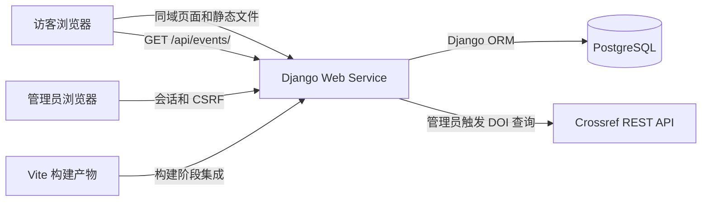

# PsychTalk Hub — 技术栈推荐

日期：2026-10-03｜适用范围：三天 MVP，约 18–24 小时｜状态：技术选型，尚未安装或验证项目依赖

产品需求与交互设计依据：[英文产品设计](design-document.md)、[中文产品设计](design-document.zh-CN.md)。本文负责具体技术选型、版本建议与部署方式。

目录说明：本文提到的 backend、frontend、memory-bank 和工作流目录均相对仓库根目录；Markdown 文档链接相对当前文件所在目录。

## 1. 推荐结论

采用 **React + Vite + JavaScript + Django REST Framework + Django Admin + PostgreSQL**，生产环境使用 **Gunicorn + WhiteNoise**，部署到 **Render 的一个 Web Service 和一个托管 PostgreSQL 数据库**，通过 **GitHub Actions** 执行检查。

前后端代码在同一仓库，生产环境使用同一域名。React 负责首页和活动详情页；Django 负责 API、管理员操作、数据校验和 Crossref 调用。Node.js 只用于开发和构建前端，生产请求由 Django 服务处理。

这个组合遵循设计文档的产品范围，并利用你已有的 Python/Django 基础。健壮性来自权限、约束、事务、超时和可重复部署；第一版保持较少的依赖和运行服务。

## 2. 核心技术与版本基线

以下是推荐的兼容版本系列。实施时选择系列内最新的稳定补丁版本，运行测试后锁定准确版本；不使用预发布版。

| 层级 | 推荐选择 | 用途与理由 |
| --- | --- | --- |
| Python | 3.13.x | 后端运行时，与选定的 Django/DRF 系列兼容 |
| Web 框架 | Django 5.2.x LTS | 内置 ORM、迁移、表单、会话和 Admin，减少需要自己搭建的基础功能 |
| REST API | Django REST Framework 3.16.x | 序列化、只读接口、统一异常响应和 API 测试工具 |
| 数据库 | PostgreSQL 17.x | 保存活动、资源和关联，支持唯一约束与事务 |
| 数据库驱动 | Psycopg 3，`psycopg[binary]` | 简化本地与托管环境的驱动安装 |
| 前端 | React 19.3.x + JavaScript | 用两个页面展示 React 能力，控制学习和调试范围 |
| 前端构建 | Vite 8.3.x + 官方 React 插件 | 开发服务器、热更新和静态构建 |
| Node.js | 24.x LTS，使用 npm | 与 Vite 配套，统一本地、CI 和部署构建环境 |
| 页面路由 | React Router 7.x，Declarative 模式 | 处理 `/` 和 `/events/:id`；不启用其服务端框架功能 |
| 样式 | 普通 CSS + CSS 自定义属性 | 直接实现设计文档的颜色、间距、断点和焦点样式 |
| 浏览器请求 | 原生 `fetch` + `AbortController` | 两个只读页面不需要额外 HTTP 客户端或请求状态库 |

Django 5.2 是 LTS，并支持 Python 3.13；DRF 3.16 的官方兼容说明也包含 Django 5.2 和 Python 3.13。[Django 说明](https://docs.djangoproject.com/en/5.2/releases/5.2/)、[DRF 说明](https://www.django-rest-framework.org/community/3.16-announcement/)。

前端版本依据当前官方发布信息选择：React 19.3、Vite 8.3 和 Node.js 24 LTS。构建前再次核对各自的补丁版本和插件兼容性。[React 版本](https://react.dev/versions)、[Vite 支持版本](https://vite.dev/releases)、[Node.js 发布状态](https://nodejs.org/en/about/previous-releases)。

PostgreSQL 17 当前仍受支持；Django 5.2 支持 PostgreSQL 14 及以上版本，并推荐 Psycopg 3。[PostgreSQL 支持周期](https://www.postgresql.org/support/versioning/)、[Django 数据库说明](https://docs.djangoproject.com/en/5.2/ref/databases/#postgresql-notes)。

### 为什么 MVP 使用 JavaScript

你当前需要同时学习 React 和交付项目，先使用 Vite 的 `react` 模板。用 JSDoc 描述 API 返回对象，把请求集中到一个模块，配合 ESLint 和服务端校验降低错误风险。

TypeScript 可以在 MVP 完成后逐步迁移；本次不让新增类型工具链成为交付前置条件。CV 如实写 React/JavaScript，不将尚未使用的 TypeScript 列为该项目技术。

## 3. 架构和部署方式

### 本地开发

- Django 在 `localhost:8000` 运行，Vite 在 `localhost:5173` 运行。
- React 通过相对路径请求 `/api/`；Vite 将该路径代理到 Django，避免为本地开发引入 CORS 配置。
- 管理员直接访问 Django 的 `/admin/`，后台登录和写入由 Django 自己处理。
- 本地数据库使用 PostgreSQL 17；如果没有本地数据库，可以使用独立的开发数据库。开发和生产必须分开，测试使用专用测试数据库。
- Windows 本地使用 Django `runserver`；Gunicorn 用于 Linux 生产环境，不要求在 Windows 上运行。

### 生产部署

推荐一个 Render Python Web Service，加同区域的托管 PostgreSQL。Render 有官方 Django 部署路径；选择它是为了减少服务器维护和部署配置。[Render Django 部署说明](https://render.com/docs/deploy-django)。

1. 构建阶段安装已锁定的 Python 依赖，用固定 Node.js 版本执行 `npm ci` 和前端构建。
2. Vite 资产使用 `/static/frontend/` 前缀，构建后放入 Django 静态目录；入口 HTML 放入模板目录。
3. Django 为 `/` 与 `/events/{id}` 返回 React 入口；React Router 处理页面切换。仅为这两类页面路由返回入口，不能将 `/api/` 或 `/admin/` 的错误转换成 HTML。
4. WhiteNoise 提供构建后的 JS/CSS 和 Admin 静态文件；Django 负责入口 HTML。WhiteNoise 本身不负责 SPA 路由回退。[WhiteNoise 配置说明](https://whitenoise.readthedocs.io/en/stable/django.html)。
5. 运行 `collectstatic`，在受控的发布阶段执行数据库迁移，再由 Gunicorn 启动 Django WSGI 应用。初始示例数据通过独立命令导入，不在每次部署时重置数据。

建议先使用少量 Gunicorn worker，以托管实例内存为准调整。该项目无 WebSocket 或实时更新需求，采用 WSGI 即可。[Django 与 Gunicorn](https://docs.djangoproject.com/en/5.2/howto/deployment/wsgi/gunicorn/)。

用 Python 标准日志输出到托管平台日志，记录导入结果和异常类别，不记录密钥或完整外部响应。提供轻量的 `/healthz/` 检查应用和数据库连通性，不调用 Crossref；检查失败返回非成功状态，不暴露内部错误详情。它只用于部署健康检查，不新增监控平台。

**部署成本取舍：** 免费 Render Web Service 会在空闲 15 分钟后休眠，免费 PostgreSQL 在创建 30 天后到期。免费方案适合短期验证，不能当作长期稳定的作品集部署。正式投递时建议选择不休眠的服务和有明确保留期限的数据库，并在部署当天核对费用与备份能力；本次文档不购买或开通任何服务。[Render 免费方案限制](https://render.com/docs/free)。

## 4. 后端依赖与职责边界

| 工具 | 职责 |
| --- | --- |
| Django Admin、Forms、Auth | 活动维护、资料维护、DOI 预览/确认表单、管理员登录和权限 |
| Django ORM | 模型、查询、迁移、唯一约束及事务 |
| DRF | 访客只读 JSON API；不自动生成公开 CRUD 写入接口 |
| `requests` | 在独立 Crossref 服务模块中完成同步 HTTP 调用 |
| `django-environ` | 读取 `.env` 和部署环境变量，解析类型与数据库 URL |
| `whitenoise` | 提供生产静态文件 |
| `gunicorn` | Linux 生产 WSGI 服务器 |

环境配置统一使用 `django-environ`，避免同时引入多个 `.env` 或数据库 URL 解析工具。[配置文档](https://django-environ.readthedocs.io/en/latest/quickstart.html)。

建议一个 Django 业务应用管理 `Event`、`Resource`、`EventResource`，将 Crossref 查询和资源关联保存拆为小的服务函数。Django Forms 校验后台输入，DRF serializers 定义公开输出，避免在视图里堆积所有业务逻辑。

**最小接口：** `/api/events/` 提供活动列表和资源数量；`/api/events/{id}/` 提供活动信息和已排序的关联资料。公开 API 只允许 GET/HEAD/OPTIONS。活动资源数量很少，标题搜索在 React 中筛选已加载的当前活动资料，无需服务器搜索接口。

## 5. 健壮性必须落在这些实现上

### 数据一致性

- `Resource.doi` 使用标准化值和数据库唯一约束；无 DOI 的手动资料使用 `NULL`，避免所有手动资料共用空字符串而发生冲突。
- `EventResource` 对 `(event, resource)` 设置唯一约束，防止重复点击和并发提交产生重复关联。
- 资源与关联的最终保存放在 `transaction.atomic()` 中；并发唯一冲突在回滚后转换为“已存在”的结果。
- Crossref 请求在事务外执行，预览阶段不写入数据库。最终保存再次检查已有资源，不覆盖共享书目信息。
- 列表资源计数使用聚合，详情资料使用关联预加载，避免每张卡片各自触发数据库查询。

### 管理员权限

- 使用 Django 原生会话 Cookie 和 CSRF，不引入 JWT、OAuth 或自建登录系统。
- 自定义 Admin 导入视图通过 Admin 的权限包装，并检查活动和资源的对应操作权限；修改数据的动作只接受受 CSRF 保护的 POST。
- 生产关闭 `DEBUG`，设置明确的 `ALLOWED_HOSTS`，通过 HTTPS 提供页面，并启用安全会话 Cookie 和 CSRF Cookie。
- `.env`、密钥和数据库连接信息不提交到 Git；只提交不含真实值的 `.env.example`。

### Crossref 集成

- 使用固定的 Crossref API 地址和标准化 DOI；不根据用户输入请求任意域名。
- 初始设置连接超时 3 秒、读取超时 7 秒；处理记录不存在、429、5xx、无效 JSON、超时和缺失字段，映射到设计文档中的提示。
- 超时是连接/读取等待限制，不是整个下载的绝对总时限。服务端不自动循环重试，允许管理员手动重试或录入。[Requests 超时说明](https://requests.readthedocs.io/en/latest/user/quickstart/#timeouts)。
- 管理员导入频率低，第一版无需 Redis 缓存或异步任务队列；普通访客读取已保存的数据，不直接依赖 Crossref 在线可用性。

### 前端与时间

- 使用 `useState`、`useEffect` 和小的请求模块管理加载、成功、失败状态；`fetch` 必须检查响应状态，组件离开时取消旧请求。
- 搜索使用去除两端空格后的标题包含匹配，忽略大小写，保持服务端给出的资料顺序。
- 启用 Django 时区支持，保存有时区的时间，以 UTC 交换时间；前端使用 `Intl.DateTimeFormat` 明确指定 `Europe/London` 展示日期时间。
- 用同一个当前时刻完成一次页面中的 Upcoming/Past 分组，边界使用 `starts_at > now`，与设计文档保持一致。

## 6. 测试、版本锁定和持续集成

**后端：** 使用 Django 自带测试框架、DRF 测试客户端和 `unittest.mock`。无需同时增加 pytest 工具链。普通事务测试与专门的并发约束测试使用 PostgreSQL，不能仅以 SQLite 的结果代替验收。

重点验证：未授权写入、CSRF、有效/无效 DOI、上游异常、预览不保存、重复关联、并发去重、事务回滚、共享资源不被覆盖，以及移除关联不影响其他活动。CI 用模拟 Crossref 响应，不依赖外部 API；另在开发阶段完成一次真实 DOI 集成验证。

**前端：** 保留 Vite React 模板的 ESLint 配置，CI 执行 lint 和生产构建。手动验证搜索、空状态、失败重试、直接打开详情链接、375 px/1280 px 布局和键盘焦点。本次不引入大型浏览器自动化测试套件。

**GitHub Actions：** 在 PR 和推送时运行上述检查；使用 PostgreSQL service container，增加迁移遗漏检查。测试通过后再发布可运行版本。

**依赖锁定：** 前端提交 `package-lock.json` 并使用 `npm ci`；后端在干净环境中确定准确的依赖及传递依赖版本，提交可复现的 `requirements.txt`，再在 Linux CI 中验证。Python、Node.js 和数据库主版本在本地说明、CI 与部署配置中保持一致。安全更新通过独立 PR 升级并运行检查，不在部署时任意获取 `latest`。

## 7. 暂不引入的工具

| 工具或方案 | 暂不采用的原因 | 何时重新考虑 |
| --- | --- | --- |
| Next.js、额外 Node.js 后端 | 现有 Django 已负责后端，两页公开界面无需第二套服务端框架 | 明确出现服务端渲染或 SEO 需求时 |
| Redux、Zustand、TanStack Query | 当前状态主要是当前活动、搜索和请求结果 | 页面和共享状态明显增加时 |
| Tailwind、大型组件库 | 普通 CSS 足以实现已确认的视觉规范 | 形成更多页面和组件体系时 |
| Axios | 原生 fetch 足以支持少量只读请求 | 请求拦截与复杂客户端策略确有需要时 |
| Redis、Celery、Elasticsearch | 无后台批处理、全站检索或高频查询需求 | 用户量或任务耗时经测量成为问题时 |
| Supabase Auth、JWT | 第一版只有 Django 管理员登录 | 增加真正的会员体系或外部客户端时 |
| Docker 全栈、Terraform、Kubernetes | 三天内会增加环境与运维工作 | 团队需要统一环境或基础设施管理时 |
| 前端 Netlify + 独立后端部署 | 增加域名、跨域和两套发布配置 | 前端需要独立发布或 CDN 策略时 |

以上是针对当前规模和开发时间的取舍，不代表这些工具不适合其他项目。后续扩展以实际需求、测试结果和观测数据为依据。

## 8. 最小交付标准

- 一个仓库、一个生产 Web Service、一个托管 PostgreSQL 数据库。
- React 两页公开体验与 Django Admin 管理流程都能运行，产品界面使用英文。
- 真实 DOI 查询能完成预览和保存，错误和重复操作有明确处理。
- 公开 API 不提供写入，后台写入经过权限、CSRF 和数据库约束保护。
- GitHub Actions 检查通过；依赖可复现；README 说明本地启动、部署、演示数据和限制。
- 在线 Demo 能直接访问和刷新活动详情，另有管理功能演示视频。

本文推荐技术和实施边界，不创建账户、不安装依赖、不修改现有产品文档，也不声称已完成性能或兼容性验证。
